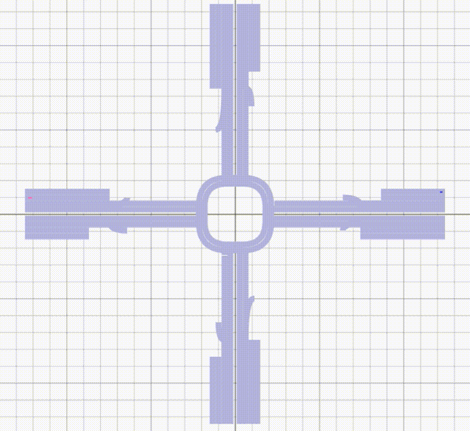
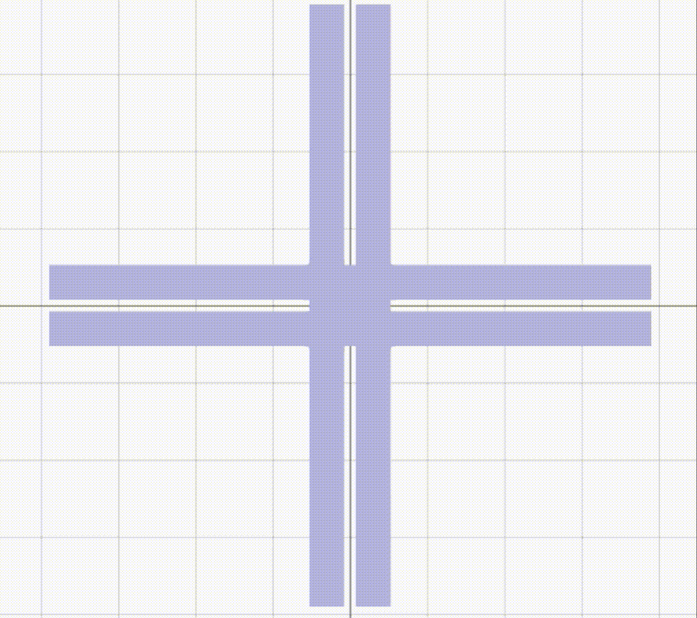

# Roundabout Traffic Simulation

## Project Background

This is a project completed in the **Engineer 2PX3: Communications and Social Impacts** course during Sprint 2. The project contains a **Python simulation for a modified traffic intersection design** that aims for safety, easy future extension, and efficiency of traffic flow, satisfying stakeholders with high interests.

For example, in **10-15 years**, a **super-hospital** will be established close to the intersection. To accommodate this, the design features **two layers of traffic intersections**:

1. **Upper Layer**: The main intersection that any vehicle can use.
2. **Lower Layer**: A small underpass directly connected to the hospital basement, used **only for patient-carrying vehicles** going to or from the hospital.

## Overview

This project simulates a traffic system with a roundabout and an underground tunnel to optimize travel time, particularly for patient-carrying vehicles. The simulation is built using SUMO (Simulation of Urban Mobility).

## Traffic Simulation Demonstration
Below some demonstrations of the simulation:






Below is a video demonstration of the old version that didn't have predestrians and bikes.
[](https://www.youtube.com/watch?v=mtedlVwetO4)
Click the thumbnail to watch the video on YouTube.

## Installation

### Dependencies

Before running any simulations, ensure all dependencies are installed. Missing dependencies may cause issues such as incorrect car colors.

### Virtual Environment Setup

1. Open the project folder.
2. Create a virtual environment:
   - Select `venv`.
   - Choose the appropriate Python version.
   - Check `requirements.txt`.
   - Click OK.
3. Wait for the dependencies to install (this may take a few minutes).

### Required Dependencies

Ensure the following packages are installed by using `requirements.txt`:

```
numpy 
scipy
dearpygui
```

## Vehicle Color Coding

- **Yellow**: Patient-carrying vehicles
- **Red**: Self-driving vehicles
- **Green**: Non-self-driving vehicles

## Running the Simulations

### 1. Ground-Level Roundabout

Run `display_sim_roundabout_upper.py` to visualize the main roundabout. Key points:

- No traffic lights (to maintain roundabout efficiency).
- Yellow cars (patient-carrying vehicles) can enter/exit tunnels.
- Arcs represent entry/exit points for patient-carrying vehicles.

### 2. Underground Tunnel Roundabout

Run `display_sim_roundabout_lower.py` to view the tunnel-based roundabout, which is exclusively for patient-carrying vehicles. Key features:

- Lower spawn rate (5x lower than default) due to restricted access.
- Higher vehicle speed (1.5x default speed) due to reduced congestion.

## Performance Results

The simulation was tested using `sim_average.py`, importing results from three different intersection types:

### Base Intersection (`base_intersection.py`)

- **Average Travel Time**: 37.16 sec
- **Variance**: 508.12 sec
- **Standard Deviation**: 22.54 sec
- **Runtime**: 33.45 sec

### Ground-Level Roundabout (`roundabout_upper.py`)

- **Intersection Size**: Twice that of base intersection
- **Speed Reduction**: 1.5x lower than default
- **Average Travel Time**: 23.07 sec (↓38%)
- **Variance**: 94.29 sec
- **Standard Deviation**: 9.71 sec
- **Runtime**: 66.79 sec

### Underground Tunnel Roundabout (`roundabout_lower.py`)

- **Spawn Rate**: 5x lower than default
- **Speed Increase**: 1.5x default speed
- **Average Travel Time**: 11.49 sec (↓50% from ground roundabout, ↓69% from base intersection)
- **Variance**: 1.12 sec
- **Standard Deviation**: 1.04 sec
- **Runtime**: 6.93 sec

## Default Simulation Parameters

- **Lane Width**: 3.5m
- **Intersection Size**: 24m (roundabouts \~49m)
- **Island Width**: 2m
- **Road Length**: 100m
- **Vehicle Spawn Rate**: 20 cars/min
- **Vehicle Speed**: 17 m/s (default)
- **Speed Variance**: 2.5 m/s
- **Self-driving to Regular Car Ratio**: 1:2 (proportion rate 0.5)
- **Patient-Carrying Vehicles**: 1 in every 5 vehicles
- **Patient-Carrying Vehicle Speed**: 1.5x default speed
- **Ground-Level Roundabout Speed**: 2/3 of default speed
- **Tunnel Spawn Rate**: Default spawn rate / 5

## Conclusion

1. **Non-Traffic Light Roundabout Efficiency**: Implementing a ground-level roundabout without traffic lights reduces average travel time by \~38% compared to a traditional traffic light intersection, even with a 1.5x lower vehicle speed and twice the intersection size.
2. **Emergency Vehicle Optimization**: The underground tunnel roundabout further reduces travel time for patient-carrying vehicles by \~50% compared to the ground-level roundabout and \~69% compared to the base traffic light intersection.

This simulation demonstrates that eliminating traffic lights and incorporating a separate emergency vehicle path significantly improves overall traffic efficiency.

