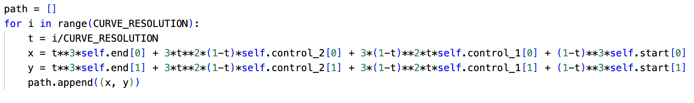

**QuadreticCurve is a sub class of Segment, meaning it inherits methods from Segment and, unless those methods are redefined, you can use Segment methods on a Cubic Curve Object.**

*Variables Defined outside of the class:*

*CURVE_RESOLUTION* = 50

`Class CubicCurve` (`start` = ($x_0$, $y_0$), `control_1` = ($xc_1$, $yc_1$), `control_2` = ($xc_2$, $yc_2$), `end` = ($x_f$, $y_f$))

`start`: The starting (x,y) coordinate for a CubicCurve segment

`end` : The ending (x,y) coordinate for a CubicCurve segment

`control_1` : a control (x,y) coordinate used to define the curve of a CubicCurve segment

`control_2` : a control (x,y) coordinate used to define the curve of a CubicCurve segment

The path of a cubic curve is defined using this algorithm:

