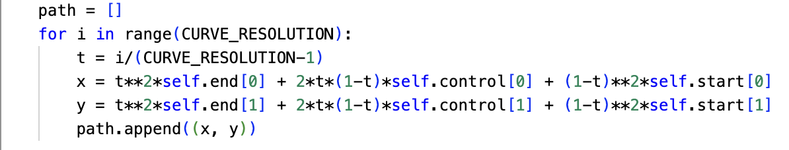

**QuadreticCurve is a sub class of Segment, meaning it inherits methods from Segment and, unless those methods are redefined, you can use Segment methods on a Quadratic Curve Object.**

*Variables Defined outside of the class:*

*PAS* = 0.01

*CURVE_RESOLUTION* = 50

`Class QuadraticCurve`(`start` = ($x_0$, $y_0$), `control` = ($x_c$, $y_c$), `end` = ($x_f$, $y_f$))

`start`: The starting (x,y) coordinate for a QuadraticCurve segment

`end` : The ending (x,y) coordinate for a QuadraticCurve segment

`control` : a control (x,y) coordinate used to define the curve of a QuadraticCurve segment

The path of a quadtratic curve is defined using this algorithm:

